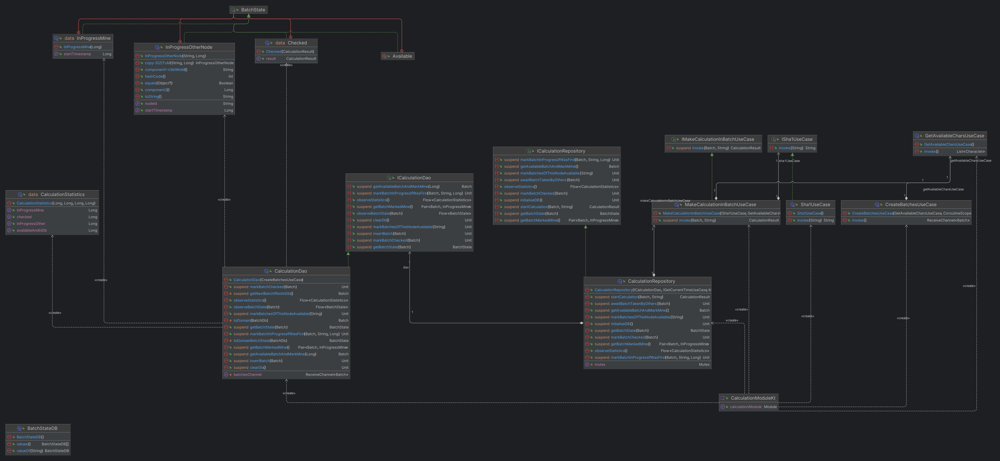
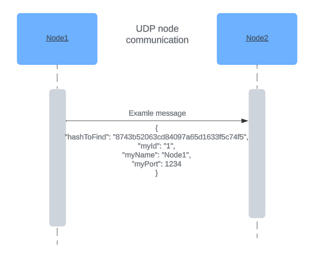
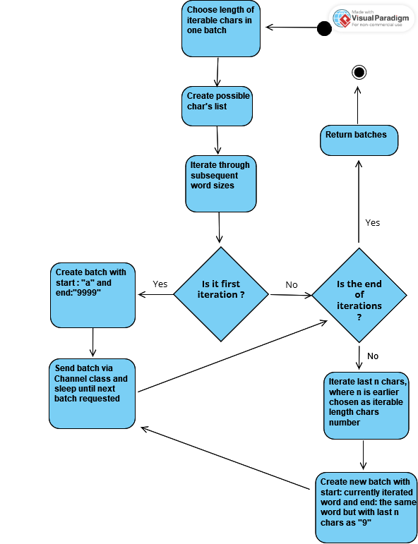

# Sha1PeerToPeerResolver

## Modules:

#### :network
Responsible for communication between nodes and holding connections  

Module contract:  

Internals:  

#### :sockets-facade
Facade module which has all sockets entities. Currently, it depends on ktor non-blocking sockets

#### :common
Classes shared between many modules

#### :nodes
Responsible for holding information about nodes and wrappers for sending broadcast information for all nodes

#### :calculation
Responsible for holding information about batches and their states, making calculations

#### Sha1PeerToPeerResolver (main module)
Jetpack Compose Desktop UI, joins all other modules, gives control over calculation via UI

## App logic activity diagram:

## TCP Sequence Diagram

## UDP Sequence Diagram

## Deployment Diagram (local network)

## Deployment Diagram (global)

## Division into Batches Activity Diagram

## 3 Design Patterns used

### Decorator
We decided to use decorator pattern to make separate class which is responsible for logging calls of methods in NodesRepository. Before we put logging logic directly in NodesRepository, so it was quite messy, and we decided to move that logic somewhere

### Simple Factory
We needed to create instances of SingleNodeConnectionHandler on demand directly in SingleNodeConnectionRepository methods. If we used constructor of SingleNodeConnectionHandler directly, it would be harder to make tests of SingleNodeConnectionHandler isolated. By providing factory for creating such classes it's possible to mock newly created instances and verify creation of these objects.  

### Facade
The basic functionality that have to be implemented is a connection between different computers.
The connection is based on a TCP/IP stack sockets from external library. The problem is that a lot of
objects have to be initialised, it is a need for tracking dependencies and calling the methods in the right order.
The solution is implementing the facade. It allows user to easily utilize the most important functions by calling
SocketsFacadeModules' methods.

